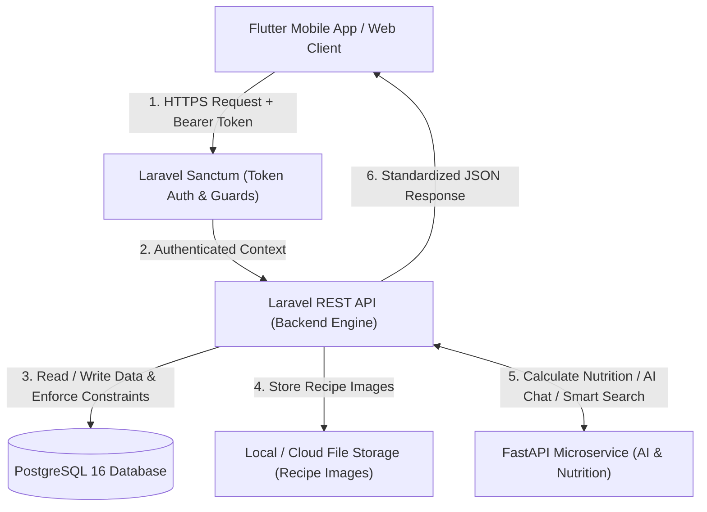
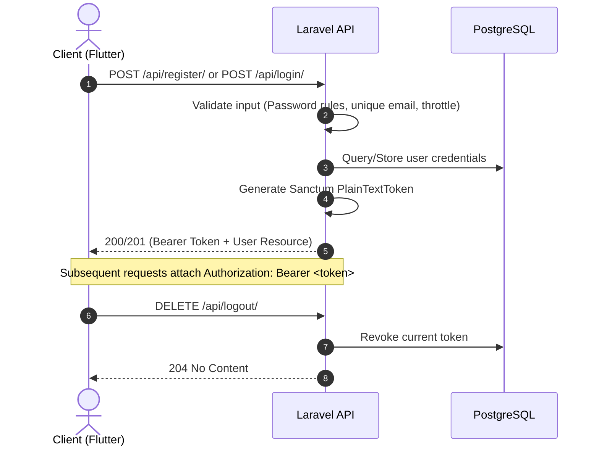
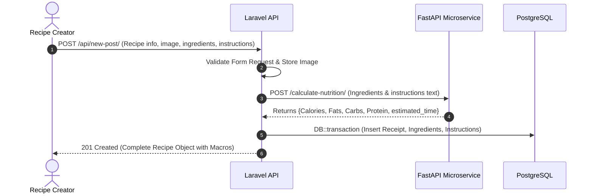
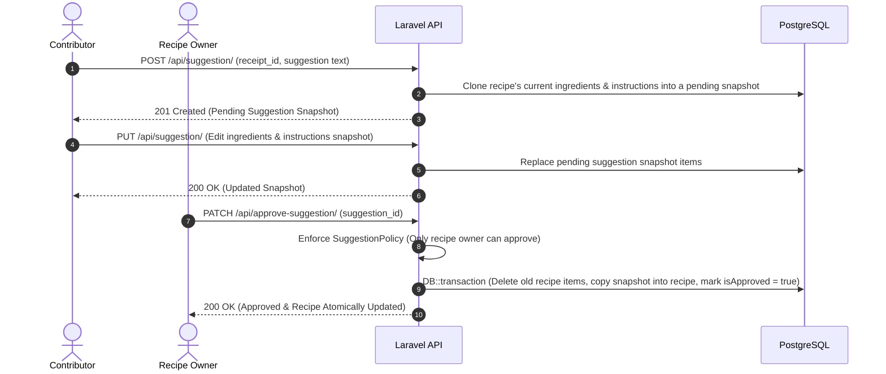

# Open Sauce Backend

[](https://laravel.com)
[](https://www.php.net/)
[](https://www.postgresql.org/)
[](https://laravel.com/docs/sanctum)
[](https://pestphp.com/)
[](https://www.docker.com/)

**Open Sauce Backend** is a high-performance, domain-driven RESTful API built with **Laravel 12/13**, **PostgreSQL 16**, and **Laravel Sanctum**, integrated with an internal **FastAPI AI microservice**. It powers the Open Sauce mobile (Flutter) and web applications, delivering a social cooking experience with intelligent recipe recommendations, automated nutritional calculations, collaborative recipe suggestion snapshots, and AI-assisted cooking conversations.

## Key Features

- **Robust Token-Based Authentication**: Secure registration and login powered by **Laravel Sanctum** bearer tokens with brute-force rate-limiting throttles (`throttle:6,1`) and password complexity validation.
- **Recipe Publishing & Media Management**: Multi-step recipe creation with photo upload, structured ingredient quantities/units, and sequential instructions.
- **Automated AI Nutrition & Prep Estimation**: Seamless integration with a FastAPI microservice to automatically calculate calories, macronutrients (protein, carbs, fats), and estimated cooking time upon recipe submission.
- **Collaborative Recipe Suggestions Engine**: Fork/snapshot mechanism allowing users to propose improvements to existing recipes. Features snapshot cloning, author revisions, and owner-only one-click approval with atomic ingredient/instruction replacement.
- **Smart "For You" Feed (FYP) & Category Browsing**: Personalized feed backed by user engagement events and AI recommendations, featuring fallback feeds and category filtering.
- **Social Engagement**: Comments on recipes, liking/unliking recipes, comments, and suggestions with idempotent toggle handling.
- **User Favorites & Profiles**: Bookmarking recipes to personal favorites and user profile management displaying owned recipes.
- **Conversational AI Chatbot & Smart Recipe Search**: Context-aware cooking assistant retaining past conversational turns, alongside multi-criteria recipe search filtered by prep time, calories, macros, and ingredient constraints.
- **Strict Data Integrity**: PostgreSQL foreign keys with cascading deletions, custom database `CHECK` constraints, PHP 8 Backed Enums, and database transactions for all multi-table mutations.


## Tech Stack & Libraries

### Backend Framework & Core
| Technology / Package | Version | Purpose |
| :--- | :--- | :--- |
| **[PHP](https://www.php.net/)** | `^8.3` / `8.4` | Server-side runtime environment with strict type safety |
| **[Laravel Framework](https://laravel.com/)** | `^13.8` | Core MVC web framework, routing, Eloquent ORM, and validation |
| **[Laravel Sanctum](https://laravel.com/docs/sanctum)** | Latest | API token authentication and bearer token guard |
| **[PostgreSQL](https://www.postgresql.org/)** | `16` | Relational database engine with custom constraint checks |

### Development, Testing & Code Quality
| Package | Purpose |
| :--- | :--- |
| **[Pest PHP](https://pestphp.com/)** (`pestphp/pest`) | Modern testing framework for unit and feature test suites |
| **[Pest Laravel Plugin](https://pestphp.com/docs/plugins/laravel)** | Laravel-specific test assertions and helpers |
| **[Laravel Pint](https://laravel.com/docs/pint)** | Opinionated PHP code style fixer conforming to PSR-12 and Laravel standards |
| **[Laravel Boost](https://laravel.com/docs/ai)** | Agentic development tooling and AI assistant skills |
| **[Laravel Pail](https://laravel.com/docs/pail)** | Real-time log tailing directly in the CLI |
| **[Mockery](https://github.com/mockery/mockery)** | Mocking framework for unit testing external HTTP and database services |
| **[FakerPHP](https://github.com/fakerphp/faker)** | Data generator for factories and automated testing fixtures |

### Frontend & Build Tooling
| Package | Purpose |
| :--- | :--- |
| **[Vite](https://vitejs.dev/)** (`^8.0.0`) | Modern frontend asset bundler |
| **[TailwindCSS](https://tailwindcss.com/)** (`^4.0.0`) | Utility-first CSS framework for administrative views |
| **[Concurrently](https://github.com/open-cli-tools/concurrently)** | Concurrent multi-process execution for local development |

---

## System Architecture & App Flow

### Architecture Overview



---

### Core Application Flows

#### 1. Authentication & Security Flow


#### 2. Recipe Publishing & Automated Nutrition Calculation


#### 3. Collaborative Recipe Suggestion & Approval Lifecycle


---

## Project Directory Structure

```
Open_Sauce_IEEE_Final_Project/
├── app/
│   ├── Enums/                     # PHP 8 Backed Enums
│   │   ├── IngredientUnit.php     # Backed enum for units: g, kg, ml, l, tsp, tbsp, cup, piece
│   │   └── ReceiptCategory.php    # Backed enum: BREAKFAST, LUNCH, DINNER, SWEETS, HOT DRINKS, ICED DRINKS
│   ├── Http/
│   │   ├── Controllers/           # Thin Controllers delegating to Services
│   │   │   ├── Auth/              # RegisterController, LoginController, LogoutController
│   │   │   ├── ChatbotController.php
│   │   │   ├── CommentController.php
│   │   │   ├── FavoritesController.php
│   │   │   ├── ProfileController.php
│   │   │   ├── ReceiptController.php
│   │   │   └── SuggestionController.php
│   │   ├── Middleware/            # Custom Middlewares (e.g. ValidateAiServiceKey)
│   │   ├── Requests/              # Form Requests for input validation & sanitization
│   │   │   ├── Auth/              # RegisterRequest, LoginRequest
│   │   │   ├── Chatbot/           # GetResponseRequest, SearchEngineRequest
│   │   │   ├── Comments/          # GetCommentsRequest, StoreCommentRequest, LikeCommentRequest
│   │   │   ├── Favorites/         # AddOrRemoveRequest, GetFavoritesRequest
│   │   │   ├── Receipt/           # CreateReceiptRequest
│   │   │   └── Suggestions/       # StoreSuggestionRequest, UpdateSuggestionRequest, ApproveSuggestionRequest
│   │   └── Resources/             # API Resources enforcing contract serialization
│   │       ├── CommentResource.php
│   │       ├── IngredientResource.php
│   │       ├── InstructionResource.php
│   │       ├── ProfileResource.php
│   │       ├── ReceiptResource.php
│   │       ├── SuggestionResource.php
│   │       └── UserResource.php
│   ├── Models/                    # Eloquent Models & Relationships
│   │   ├── ChatHistory.php
│   │   ├── Comment.php
│   │   ├── Event.php
│   │   ├── Favorites.php
│   │   ├── Ingredient.php
│   │   ├── Instruction.php
│   │   ├── Receipt.php
│   │   ├── Recommendation.php
│   │   ├── Suggestion.php
│   │   └── User.php
│   ├── Policies/                  # Authorization Policies (e.g. SuggestionPolicy)
│   ├── Providers/                 # Service Providers
│   └── Services/                  # Business Logic & DB Transactions
│       ├── Auth/                  # RegisterService, LoginService, LogoutService
│       ├── ChatbotService.php
│       ├── CommentService.php
│       ├── FavoritesService.php
│       ├── ProfileService.php
│       └── SuggestionService.php
├── bootstrap/                     # Application bootstrap & middleware pipeline
├── config/                        # Laravel configuration files (database, services, auth)
├── database/
│   ├── factories/                 # Eloquent model factories for testing
│   ├── migrations/                # PostgreSQL migration files (with CHECK constraints)
│   └── seeders/                   # Database seeders
├── docs/                          # Official Project Documentation & Specifications
│   ├── 00-project-overview.md
│   ├── 01-database-schema.md
│   ├── 02-api-contract.md
│   ├── 03-authentication.md
│   ├── 04-architecture-rules.md
│   ├── 05-ai-integration.md
│   ├── 07-decisions-log.md
│   ├── 08-current-status.md
│   └── 09-testing-strategy.md
├── postman/                       # Postman Collection & Environment JSON files
├── routes/
│   ├── api.php                    # REST API route definitions
│   ├── console.php                # CLI commands
│   └── web.php                    # Web routes
├── storage/                       # Uploaded images, framework cache & logs
├── tests/
│   ├── Feature/                   # Comprehensive Feature Tests (Auth, Comments, Suggestions, FYP, etc.)
│   └── Unit/                      # Unit Tests
├── docker-compose.yml             # Local multi-container development environment
├── Dockerfile                     # Production-ready PHP 8.4 container
└── phpunit.xml                    # PHPUnit / Pest configuration
```

---

## Database Schema & Integrity

The backend runs on **PostgreSQL 16**. Key schema design principles include:

1. **Strict Key Naming**: Primary keys follow domain-specific identifiers (e.g., `user_id` on `users`, `receipt_id` on `receipts`, `id` on child tables).
2. **Mutual Exclusion `CHECK` Constraints**:
   - `ingredients` and `instructions` tables support both original recipes and proposed suggestions. A PostgreSQL check constraint guarantees that an item belongs to **either** a recipe or a suggestion, never both or neither:
     ```sql
     CHECK ((receipt_id IS NULL AND suggestion_id IS NOT NULL) OR (receipt_id IS NOT NULL AND suggestion_id IS NULL))
     ```
3. **Cascading Deletes (`ON DELETE CASCADE`)**: Deleting a user or recipe cleanly cleans up all related comments, likes, ingredients, instructions, and suggestions.
4. **Typed Backed Enums**:
   - `ReceiptCategory`: `BREAKFAST`, `LUNCH`, `DINNER`, `SWEETS`, `HOT DRINKS`, `ICED DRINKS`
   - `IngredientUnit`: `g`, `kg`, `ml`, `l`, `tsp`, `tbsp`, `cup`, `piece`
5. **Single Timestamps**: Explicit single `timestamp` columns stored in UTC ISO-8601 format.

---

## Installation & Setup Guide

### Prerequisites

Ensure you have the following installed on your machine:
- **PHP 8.3 or 8.4** with extensions: `pdo_pgsql`, `pdo_sqlite`, `curl`, `mbstring`, `zip`, `xml`, `bcmath`
- **Composer 2.x**
- **Node.js 18+** & **npm**
- **Docker & Docker Compose** (Optional, recommended for PostgreSQL)
- **PostgreSQL 16** (If running without Docker)

---

### Option A: Docker Compose (Recommended)

The repository includes a ready-to-run multi-container setup containing the **PHP 8.4 Application Server** and a **PostgreSQL 16 Alpine** container.

1. **Clone the repository**:
   ```bash
   git clone https://github.com/your-org/open-sauce-backend.git
   cd open-sauce-backend
   ```

2. **Prepare Environment File**:
   ```bash
   cp .env.example .env
   ```

3. **Start the Containers**:
   ```bash
   docker compose up -d --build
   ```

4. **Initialize the Application inside the container**:
   ```bash
   # Generate application key
   docker compose exec app php artisan key:generate

   # Run PostgreSQL migrations
   docker compose exec app php artisan migrate

   # Create public storage symlink for uploaded recipe photos
   docker compose exec app php artisan storage:link
   ```

5. **Verify the server**:
   Access the API at `http://localhost:8000`.

---

### Option B: Native / Local Environment

1. **Clone and install Composer dependencies**:
   ```bash
   git clone https://github.com/your-org/open-sauce-backend.git
   cd open-sauce-backend
   composer install
   ```

2. **Install Node dependencies & build assets**:
   ```bash
   npm install
   npm run build
   ```

3. **Configure the Environment**:
   ```bash
   cp .env.example .env
   php artisan key:generate
   ```

4. **Configure your Database in `.env`**:
   Ensure PostgreSQL is running locally and configure `.env`:
   ```dotenv
   DB_CONNECTION=pgsql
   DB_HOST=127.0.0.1
   DB_PORT=5432
   DB_DATABASE=open_sauce
   DB_USERNAME=your_pg_user
   DB_PASSWORD=your_pg_password
   ```

5. **Run Migrations**:
   ```bash
   php artisan migrate
   ```

6. **Create Public Storage Symlink**:
   ```bash
   php artisan storage:link
   ```

7. **Start the Development Server**:
   ```bash
   php artisan serve
   ```
   Or run all services concurrently (HTTP server, queue listener, logs):
   ```bash
   composer run dev
   ```

---

### Environment Variables Configuration

Key variables configured in `.env`:

| Variable | Description | Default / Example |
| :--- | :--- | :--- |
| `APP_ENV` | Application environment | `local` / `production` |
| `APP_KEY` | Laravel encryption key | Auto-generated via `artisan key:generate` |
| `APP_URL` | Application base URL | `http://localhost:8000` |
| `DB_CONNECTION` | Database driver | `pgsql` |
| `DB_HOST` | Database host address | `db` (Docker) or `127.0.0.1` |
| `DB_PORT` | Database port | `5432` |
| `DB_DATABASE` | PostgreSQL database name | `open_sauce` |
| `DB_USERNAME` | PostgreSQL user | `open_sauce_user` |
| `DB_PASSWORD` | PostgreSQL password | `open_sauce_pass` |
| `AI_SERVICE_URL` | Endpoint of the FastAPI AI service | `https://ai-service-mii4.onrender.com/api/ai/` |
| `AI_SERVICE_API_KEY` | Internal shared API key for AI endpoints | Configured in deployment |

---

## API Usage & Quickstart

### 1. Authentication Flow

Protected endpoints require the **Bearer Token** obtained from `/api/login/` or `/api/register/`:

```http
Authorization: Bearer <your_token_here>
Accept: application/json
```

> **Security Note**: Never send `user_id` in request bodies. The backend derives user identity securely from `auth()->id()`.

---

### 2. API Endpoints Directory

| Category | Method | Endpoint | Auth | Purpose |
| :--- | :---: | :--- | :---: | :--- |
| **Auth** | `POST` | `/api/register/` | Public | Register a new user (`name`, `email`, `password`) |
| **Auth** | `POST` | `/api/login/` | Public | Authenticate user & issue Sanctum token |
| **Auth** | `DELETE` | `/api/logout/` | Bearer | Revoke current access token |
| **Profile** | `GET` | `/api/profile/` | Bearer | Get authenticated user profile & created recipes |
| **Feed / FYP**| `GET` | `/api/fyp/` | Bearer | Personalized For You Page recipe feed |
| **Feed / FYP**| `GET` | `/api/specific-content/` | Bearer | Filter recipes by category (`?category=BREAKFAST`) |
| **Feed / FYP**| `POST` | `/api/add-event/` | Bearer | Track user browsing events for recommendations |
| **Recipes** | `GET` | `/api/receipt-details/` | Bearer | Get full recipe details (`?receipt_id={id}`) |
| **Recipes** | `POST` | `/api/new-post/` | Bearer | Create recipe + compute AI nutrition |
| **Recipes** | `POST` | `/api/like/` | Bearer | Like a recipe (`receipt_id`) |
| **Recipes** | `DELETE` | `/api/unlike/` | Bearer | Unlike a recipe (`receipt_id`) |
| **Favorites** | `GET` | `/api/favorites/` | Bearer | List user's saved favorite recipes |
| **Favorites** | `POST` | `/api/add-favorite/` | Bearer | Add a recipe to favorites (`receipt_id`) |
| **Favorites** | `DELETE` | `/api/remove-favorite/` | Bearer | Remove recipe from favorites (`receipt_id`) |
| **Comments** | `GET` | `/api/comments/` | Bearer | List paginated comments on a recipe |
| **Comments** | `POST` | `/api/comment/` | Bearer | Add comment to a recipe |
| **Comments** | `POST` | `/api/like-comment/` | Bearer | Like a comment (idempotent) |
| **Comments** | `DELETE` | `/api/like-comment/` | Bearer | Remove like from comment |
| **Suggestions**| `GET` | `/api/suggestions/` | Bearer | List recipe suggestions & snapshot items |
| **Suggestions**| `POST` | `/api/suggestion/` | Bearer | Fork recipe snapshot & create pending suggestion |
| **Suggestions**| `PUT` | `/api/suggestion/` | Bearer | Update pending suggestion snapshot |
| **Suggestions**| `POST` | `/api/like-suggestion/` | Bearer | Like a suggestion (idempotent) |
| **Suggestions**| `DELETE`| `/api/like-suggestion/` | Bearer | Remove like from suggestion |
| **Suggestions**| `PATCH` | `/api/approve-suggestion/` | Bearer | Approve suggestion & update recipe atomically |
| **Chatbot** | `GET` | `/api/get-ai-response/` | Bearer | Query conversational AI assistant (`?prompt=...`) |
| **Internal AI**| `POST` | `/api/search-engine/` | API Key | Filtered recipe search for AI microservice |

---

### 3. Postman Collection

A complete, pre-configured Postman collection with contract examples is located at:
```
postman/Open Sauce Documentation - Complete API Contract v4.postman_collection.json
```

Import this file into Postman, set your `baseUrl` variable to `http://localhost:8000`, and all requests are ready to test.

---

### 4. Key API Workflows (cURL Examples)

#### Register User
```bash
curl -X POST http://localhost:8000/api/register/ \
  -H "Content-Type: application/json" \
  -H "Accept: application/json" \
  -d '{
    "name": "Sarah Connor",
    "email": "sarah@example.com",
    "password": "Password123!"
  }'
```

#### Publish a Recipe (Multipart Form Data with AI Nutrition Calculation)
```bash
curl -X POST http://localhost:8000/api/new-post/ \
  -H "Authorization: Bearer <TOKEN>" \
  -H "Accept: application/json" \
  -F "receipt[name]=Protein Pancakes" \
  -F "receipt[caption]=Delicious morning protein pancakes" \
  -F "receipt[category]=BREAKFAST" \
  -F "receipt[image]=@/path/to/pancakes.jpg" \
  -F "ingredients[0][name]=Oats" \
  -F "ingredients[0][quantity]=100" \
  -F "ingredients[0][unit]=g" \
  -F "ingredients[1][name]=Eggs" \
  -F "ingredients[1][quantity]=2" \
  -F "ingredients[1][unit]=piece" \
  -F "instructions[0]=Blend oats and eggs together." \
  -F "instructions[1]=Cook on medium heat for 3 minutes per side."
```

#### Propose a Recipe Improvement Suggestion
```bash
curl -X POST http://localhost:8000/api/suggestion/ \
  -H "Authorization: Bearer <TOKEN>" \
  -H "Content-Type: application/json" \
  -H "Accept: application/json" \
  -d '{
    "receipt_id": 1,
    "text": "Add a scoop of whey protein powder and cinnamon for better flavor and protein ratio."
  }'
```

#### Approve Suggestion (Recipe Owner Only — Triggers Atomic Replacement)
```bash
curl -X PATCH http://localhost:8000/api/approve-suggestion/ \
  -H "Authorization: Bearer <TOKEN>" \
  -H "Content-Type: application/json" \
  -H "Accept: application/json" \
  -d '{
    "suggestion_id": 1
  }'
```

---

## Testing & Code Quality

The backend includes a comprehensive automated test suite powered by **Pest PHP** and **PHPUnit**, covering unit, feature, authorization, boundary, and multi-user end-to-end scenarios.

### Running Automated Tests

```bash
# Run all test suites
php artisan test

# Or using Pest CLI directly
./vendor/bin/pest

# Run a specific test group / file
./vendor/bin/pest tests/Feature/Suggestions/ApproveSuggestionTest.php
```

### Code Formatting with Laravel Pint

To check and fix code style conforming to PSR-12 and Laravel guidelines:

```bash
# Check code formatting
./vendor/bin/pint --test

# Fix code formatting automatically
./vendor/bin/pint
```

---

## License

The Open Sauce backend is open-sourced software licensed under the [MIT License](https://opensource.org/licenses/MIT).
